<div align="center">

# 🎯 BDD Card Generator

### Transforme documentos do Google Docs em tarefas do Jira automaticamente usando Inteligência Artificial

[](https://nodejs.org/)
[](https://www.typescriptlang.org/)
[](LICENSE)

[🚀 Início Rápido](#-início-rápido-5-minutos) • [📖 Documentação](#-o-que-este-projeto-faz) • [🆘 Ajuda](#-resolução-de-problemas) • [❓ FAQ](#-perguntas-frequentes-faq)

</div>

---

## 🎬 Demonstração Visual

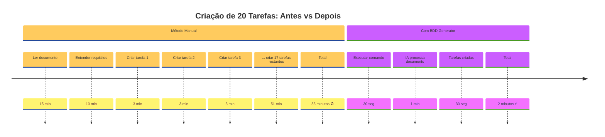

**Resultado:** 📊 Economize **97% do tempo** + ✅ **Zero erros** de formatação

---

## 💡 O que este projeto faz?

Este projeto é uma ferramenta de linha de comando que automatiza a criação de cards no Jira a partir de requisitos escritos em documentos do Google Docs. A inteligência artificial lê o documento, entende os requisitos e cria automaticamente as tarefas no formato BDD (Behavior-Driven Development).

## 📖 O que este projeto faz?

**Em palavras simples:**
1. Você escreve os requisitos de um projeto em um documento do Google Docs
2. A ferramenta lê automaticamente esse documento
3. Uma inteligência artificial (Gepeto ou Gemini) analisa o conteúdo e cria histórias de usuário
4. As histórias são automaticamente criadas como tarefas no Jira
5. Pronto! Você economizou horas de trabalho manual

**Exemplo prático:**
- **Antes**: Você gastaria 2 horas lendo um documento e criando 20 tarefas manualmente no Jira
- **Depois**: A ferramenta faz isso em 2 minutos automaticamente

## 🎬 Como funciona?

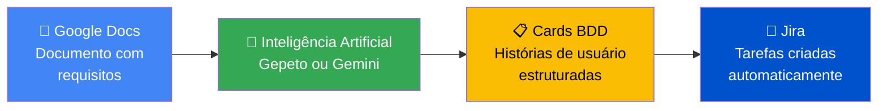

## ✨ Recursos e Benefícios

| Recurso | O que significa | Benefício |
|---------|----------------|-----------|
| 🔧 **Configuração Interativa** | Perguntas e respostas simples para configurar | Não precisa ser programador |
| 🔐 **Login Seguro** | Login automático com Google e Jira | Seus dados ficam protegidos |
| 📄 **Integração Google Docs** | Lê documentos automaticamente | Não precisa copiar e colar |
| 🤖 **Inteligência Artificial** | Gepeto ou Google Gemini entendem o texto | Cria tarefas inteligentes |
| 🎫 **Integração Jira** | Conecta direto com seu Jira | Tarefas aparecem instantaneamente |
| 🔄 **Criação em Lote** | Cria várias tarefas de uma vez | Economiza muito tempo |
| 🧪 **Modo de Teste** | Testa sem criar tarefas de verdade | Seguro para experimentar |
| 📊 **Relatórios Detalhados** | Mostra o que está fazendo | Você fica no controle |

## 🚀 Início Rápido (5 minutos)

### Pré-requisitos

Antes de começar, você precisa ter instalado no seu computador:
- **Node.js** (versão 18 ou superior) - [Baixar aqui](https://nodejs.org/)
- Uma conta no **Jira** com permissão para criar tarefas
- Uma conta do **Google** com acesso ao Google Docs

### Passo 1: Instalar o Projeto

```bash
# 1. Baixar o projeto
git clone <repository-url>
cd generate-bdd-cards

# 2. Instalar as dependências (bibliotecas necessárias)
npm install

# 3. Compilar o projeto
npm run build
```

### Passo 2: Configuração Inicial

```bash
# Execute o assistente de configuração
npm run dev init
```

O sistema vai fazer perguntas como:
- Qual o endereço do seu Jira? (ex: `https://suaempresa.atlassian.net`)
- Qual seu email do Jira?
- Qual a chave de API do Jira?
- Qual o ID do documento do Google Docs?
- Etc.

### Passo 3: Criar Tarefas!

```bash
# Modo de teste (não cria tarefas de verdade)
npm run dev workflow --dry-run

# Modo real (cria tarefas no Jira)
npm run dev workflow --live
```

## 🎯 Uso Simplificado com Links Diretos

**A forma mais fácil de usar!** Apenas copie os links do Google Docs e do Jira:

```bash
npm run quick-create \
  "https://docs.google.com/document/d/SEU_DOCUMENTO_ID/edit" \
  "https://suaempresa.atlassian.net/jira/software/projects/PROJ/boards/123" \
  --live
```

### Diagrama do Fluxo Rápido

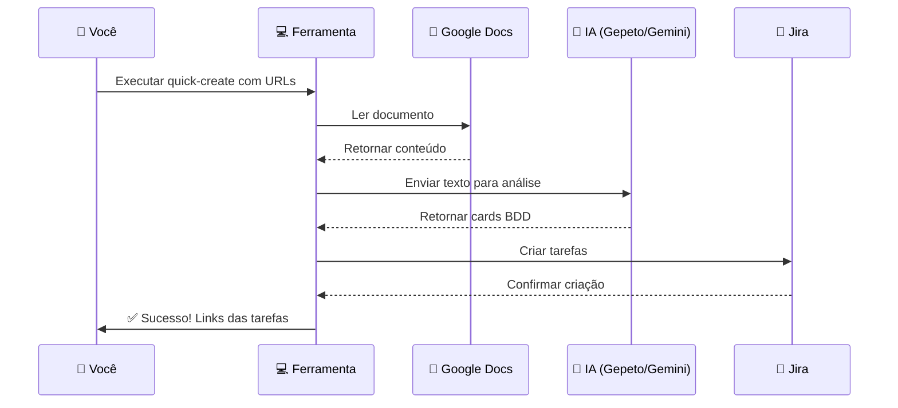

## 📋 Guia Passo a Passo Detalhado

### Entendendo a Arquitetura

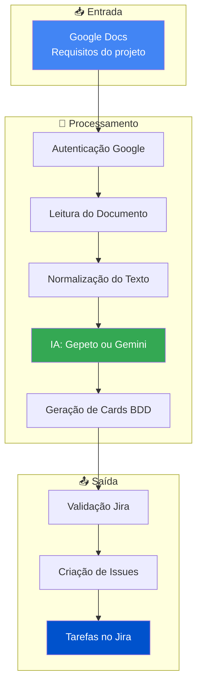

### Fluxo de Trabalho Completo

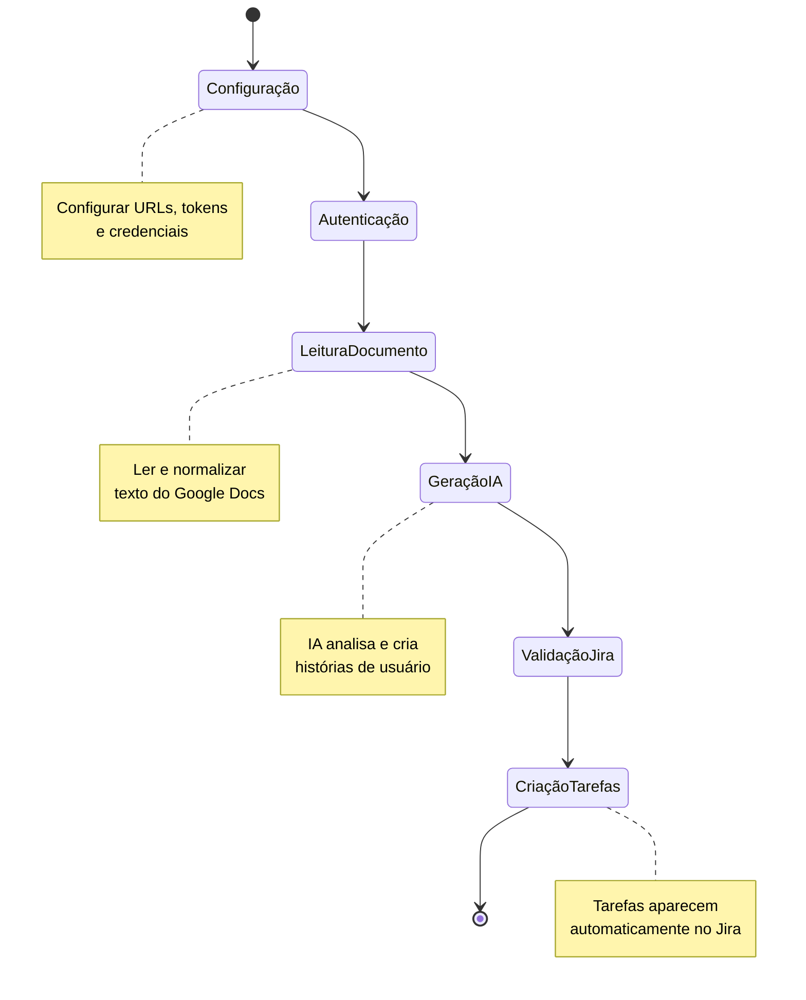

## ⚙️ Configuração Detalhada

A ferramenta usa um arquivo `.env.local` para guardar suas configurações. Você pode criar este arquivo de duas formas:

**Opção 1: Assistente Interativo (Recomendado)**
```bash
npm run dev init
```

**Opção 2: Criação Manual**

Copie o arquivo de exemplo e edite:
```bash
cp .env.example .env.local
# Depois abra o arquivo .env.local em um editor de texto
```

### 1️⃣ Configuração do Jira

```env
# URL do seu Jira (onde você acessa o Jira no navegador)
JIRA_BASE_URL=https://suaempresa.atlassian.net

# Seu email cadastrado no Jira
JIRA_EMAIL=seu.email@empresa.com

# Token de acesso (explicado abaixo)
JIRA_API_TOKEN=seu_token_aqui

# Sigla do projeto (ex: PROJ, DEV, TASK)
JIRA_PROJECT_KEY=PROJ

# Tipo de tarefa (Story, Task, Bug, etc)
JIRA_ISSUE_TYPE=Story

# ID do quadro (número que aparece na URL do quadro)
JIRA_BOARD_ID=123

# Tags padrão para as tarefas
JIRA_DEFAULT_LABELS=automatizado,bdd

# Prioridade padrão
JIRA_PRIORITY=Medium
```

**Como obter o Token do Jira:**
1. Acesse: https://id.atlassian.com/manage-profile/security/api-tokens
2. Clique em "Criar token de API"
3. Dê um nome (ex: "BDD Generator")
4. Copie o token gerado (você só verá uma vez!)

### 2️⃣ Configuração do Google Docs

#### Opção A: OAuth (Login com Google - Mais Fácil)

```env
# ID do documento (está na URL do Google Docs)
# Exemplo de URL: https://docs.google.com/document/d/ABC123XYZ/edit
# O ID seria: ABC123XYZ
GOOGLE_DOCS_DOCUMENT_ID=seu_document_id

# Credenciais OAuth (obtidas no Google Cloud Console)
GOOGLE_OAUTH_CLIENT_ID=seu_client_id
GOOGLE_OAUTH_CLIENT_SECRET=seu_client_secret
GOOGLE_OAUTH_REDIRECT_URIS=http://localhost:3000/
GOOGLE_OAUTH_SCOPES=https://www.googleapis.com/auth/documents.readonly
```

**Como obter credenciais OAuth:**
1. Acesse: https://console.cloud.google.com/
2. Crie um novo projeto ou selecione um existente
3. Ative a API do Google Docs
4. Vá em "Credenciais" → "Criar Credenciais" → "ID do cliente OAuth 2.0"
5. Configure o tipo como "Aplicativo da Web"
6. Adicione `http://localhost:3000/` como URI de redirecionamento
7. Copie o Client ID e Client Secret

#### Opção B: Service Account (Para Servidores)

```env
GOOGLE_DOCS_DOCUMENT_ID=seu_document_id
GOOGLE_APPLICATION_CREDENTIALS=caminho/para/service-account.json
```

**Importante:** Compartilhe o documento do Google Docs com o email da service account!

### 3️⃣ Configuração da Inteligência Artificial

**Escolha UMA das opções abaixo:**

#### Opção A: Gepeto (IA Interna)

```env
# URL base da API do Gepeto
GEPETO_API_BASE=https://sua-instancia-gepeto.com

# Chave de API do Gepeto
GEPETO_API_KEY=sua_chave_gepeto

# Modelo de IA a ser usado
GEPETO_MODEL=gpt-5

# Endpoint da API
GEPETO_ENDPOINT=/v1/chat/completions
```

#### Opção B: Google Gemini (IA do Google)

```env
# Chave de API do Gemini
GEMINI_API_KEY=sua_chave_gemini

# Modelo de IA a ser usado
GEMINI_MODEL=gemini-2.5-pro

# URL base da API
GEMINI_API_BASE=https://generativelanguage.googleapis.com/v1beta/models

# Endpoint específico
GEMINI_ENDPOINT=gemini-2.5-pro
```

**Como obter chave do Gemini:**
1. Acesse: https://makersuite.google.com/app/apikey
2. Clique em "Create API Key"
3. Copie a chave gerada

> 💡 **Dica:** Se você configurar ambas as IAs, a ferramenta vai perguntar qual você quer usar cada vez que rodar.

### 4️⃣ Configuração do Modo de Operação

```env
# Modo de teste (não cria tarefas de verdade)
APP_MODE=dry-run

# OU modo real (cria tarefas no Jira)
# APP_MODE=live
```

## 🎮 Comandos Disponíveis

### 📝 Comandos Principais (Para Uso Diário)

#### ⚡ `quick-create` - Comando Mais Rápido

**O que faz:** Cria tarefas no Jira direto pelos links (não precisa configurar IDs)

```bash
npm run quick-create \
  "URL_DO_GOOGLE_DOCS" \
  "URL_DO_JIRA" \
  --live
```

**Exemplo real:**
```bash
npm run quick-create \
  "https://docs.google.com/document/d/1ABC123XYZ/edit" \
  "https://minhaempresa.atlassian.net/jira/software/projects/DEV/boards/456" \
  --live
```

**Opções:**
- `--live`: Cria tarefas de verdade no Jira
- `--dry-run`: Apenas simula (modo de teste)
- `--ai gepeto`: Força uso do Gepeto
- `--ai gemini`: Força uso do Gemini

#### 🔄 `workflow` - Fluxo Completo

**O que faz:** Executa todo o processo: ler documento → gerar cards → criar tarefas

```bash
# Modo teste
npm run dev workflow --dry-run

# Modo real
npm run dev workflow --live

# Escolher IA específica
npm run dev workflow --ai gepeto --live
```

#### ✅ `validate-links` - Validar URLs

**O que faz:** Testa se os links do Google Docs e Jira estão corretos ANTES de criar tarefas

```bash
npm run validate-links \
  -d "URL_DO_GOOGLE_DOCS" \
  -j "URL_DO_JIRA"
```

**Exemplo:**
```bash
npm run validate-links \
  -d "https://docs.google.com/document/d/1ABC123/edit" \
  -j "https://empresa.atlassian.net/jira/software/projects/PROJ/boards/123"
```

### 🔧 Comandos de Configuração

#### `init` - Configuração Inicial

**O que faz:** Cria o arquivo de configuração através de perguntas e respostas

```bash
npm run dev init
```

#### `jira:validate` - Validar Configuração do Jira

**O que faz:** Verifica quais campos são obrigatórios no seu projeto Jira

```bash
npm run dev jira:validate
```

Útil para saber que informações você precisa preencher nas tarefas.

### 🔨 Comandos Avançados (Passo a Passo Manual)

Se você quiser controlar cada etapa individualmente:

#### 1️⃣ Ler o Google Docs

```bash
npm run dev gdocs:read
```

Salva o conteúdo em `.cache/source_doc_latest.md`

#### 2️⃣ Gerar Cards BDD

```bash
# Deixar a IA escolher
npm run dev cards:generate

# Forçar Gepeto
npm run dev gepeto:generate

# Forçar Gemini
npm run dev gemini:generate
```

Salva os cards em `.cache/bdd_cards_latest.json`

#### 3️⃣ Criar Tarefas no Jira

```bash
npm run dev jira:create-batch
```

### 📊 Diagrama de Comandos

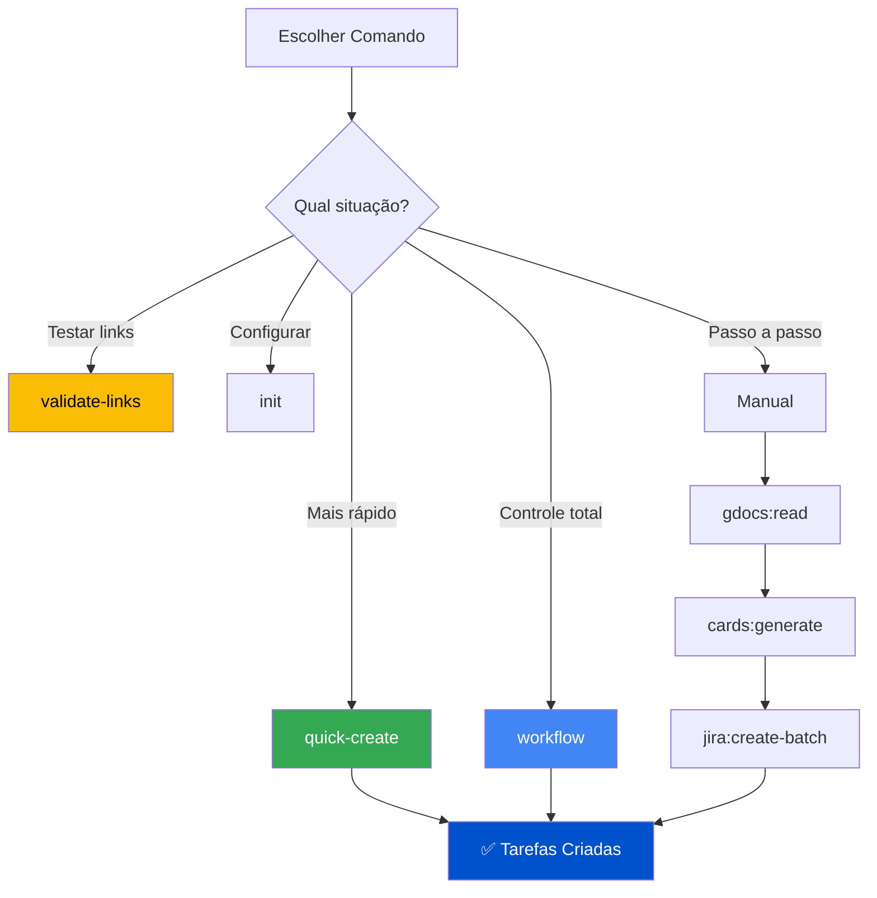

## 💡 Exemplos Práticos de Uso

### Exemplo 1: Primeiro Uso (Do Zero)

```bash
# Passo 1: Configurar tudo
npm run dev init
# Responda as perguntas sobre Jira, Google Docs, etc.

# Passo 2: Testar se está tudo certo (modo seguro)
npm run dev workflow --dry-run
# Vai mostrar quais tarefas SERIAM criadas, mas não cria de verdade

# Passo 3: Criar tarefas de verdade
npm run dev workflow --live
# Agora sim! As tarefas aparecem no Jira
```

### Exemplo 2: Uso Rápido com Links

```bash
# Apenas copie e cole os links (mais simples!)
npm run quick-create \
  "https://docs.google.com/document/d/1XYZ789/edit" \
  "https://minhaempresa.atlassian.net/jira/software/projects/DEV/boards/123" \
  --live
```

### Exemplo 3: Testar Antes de Criar

```bash
# Valide se os links estão corretos
npm run validate-links \
  -d "https://docs.google.com/document/d/1XYZ789/edit" \
  -j "https://minhaempresa.atlassian.net/jira/software/projects/DEV/boards/123"

# Se aparecer ✅ verde, está tudo certo!
# Agora pode criar as tarefas
npm run quick-create \
  "https://docs.google.com/document/d/1XYZ789/edit" \
  "https://minhaempresa.atlassian.net/jira/software/projects/DEV/boards/123" \
  --live
```

### Exemplo 4: Processo Manual (Controle Total)

```bash
# Etapa 1: Ler o documento do Google
npm run dev gdocs:read
# Resultado: arquivo salvo em .cache/source_doc_latest.md

# Etapa 2: Ver o que a IA vai criar (ainda não cria)
npm run dev cards:generate
# Resultado: arquivo salvo em .cache/bdd_cards_latest.json
# Você pode abrir e ver os cards antes de criar no Jira!

# Etapa 3: Criar as tarefas no Jira
npm run dev jira:create-batch --live
# Resultado: Tarefas criadas! Links aparecem no terminal
```

### Exemplo 5: Escolher qual IA usar

```bash
# Usar o Gepeto (IA interna)
npm run dev workflow --ai gepeto --live

# Usar o Gemini (IA do Google)
npm run dev workflow --ai gemini --live

# Não especificar (a ferramenta pergunta qual usar)
npm run dev workflow --live
```

### 🎯 Cenários Reais de Uso

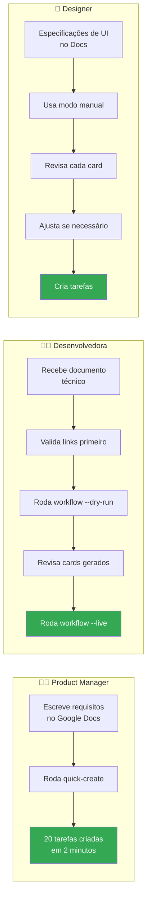

## 🔐 Guia de Autenticação Completo

### 🎫 Configurando o Jira (5 minutos)

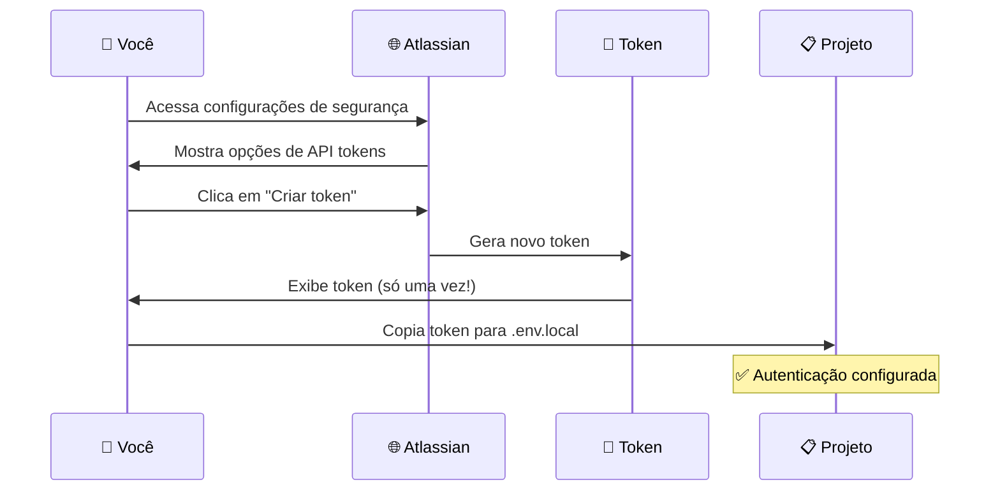

#### Passo a Passo Detalhado:

1. **Acesse a página de tokens:**
   - URL: https://id.atlassian.com/manage-profile/security/api-tokens
   - Faça login com sua conta Atlassian

2. **Crie um novo token:**
   - Clique no botão "Criar token de API"
   - Dê um nome descritivo (ex: "BDD Card Generator")
   - Clique em "Criar"

3. **Copie o token:**
   - ⚠️ **IMPORTANTE:** O token só é mostrado UMA vez!
   - Copie e guarde em lugar seguro
   - Cole no arquivo `.env.local` na variável `JIRA_API_TOKEN`

4. **Configure os outros dados:**
   ```env
   JIRA_BASE_URL=https://suaempresa.atlassian.net
   JIRA_EMAIL=seu.email@empresa.com
   JIRA_API_TOKEN=seu_token_copiado_aqui
   ```

### 📄 Configurando o Google Docs

#### Opção 1: OAuth (Mais Fácil - Recomendado)

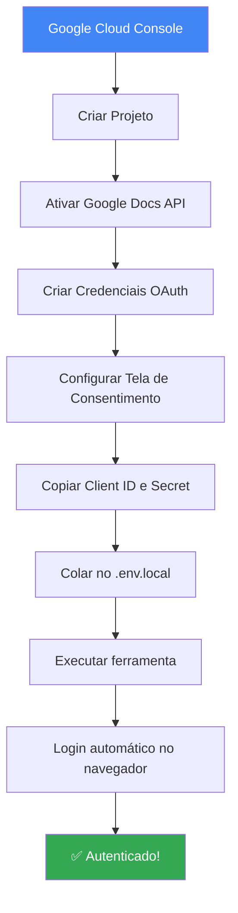

**Passo a Passo:**

1. **Acesse o Google Cloud Console:**
   - URL: https://console.cloud.google.com/
   - Faça login com sua conta Google

2. **Crie ou selecione um projeto:**
   - Clique no menu de projetos (canto superior)
   - Clique em "Novo Projeto"
   - Dê um nome (ex: "BDD Card Generator")
   - Clique em "Criar"

3. **Ative a API do Google Docs:**
   - No menu lateral, vá em "APIs e Serviços" → "Biblioteca"
   - Procure por "Google Docs API"
   - Clique e depois em "Ativar"

4. **Crie credenciais OAuth:**
   - Vá em "APIs e Serviços" → "Credenciais"
   - Clique em "Criar Credenciais" → "ID do cliente OAuth 2.0"
   - Se pedir, configure a "Tela de consentimento OAuth":
     - Escolha "Externo"
     - Preencha nome do app, email de suporte
     - Adicione seu email como usuário de teste
   - Tipo de aplicativo: "Aplicativo da Web"
   - Nome: "BDD Card Generator"
   - URIs de redirecionamento: `http://localhost:3000/`
   - Clique em "Criar"

5. **Copie as credenciais:**
   ```env
   GOOGLE_OAUTH_CLIENT_ID=123456789-abcdefgh.apps.googleusercontent.com
   GOOGLE_OAUTH_CLIENT_SECRET=GOCSPX-abc123xyz
   ```

6. **Quando executar a ferramenta:**
   - Uma página do navegador vai abrir automaticamente
   - Faça login com sua conta Google
   - Autorize o acesso (clique em "Permitir")
   - Pronto! O token fica salvo em `.google_tokens.json`

#### Opção 2: Service Account (Para Servidores)

**Quando usar:** Ambientes automatizados, servidores, CI/CD

1. No Google Cloud Console, vá em "IAM e Admin" → "Contas de Serviço"
2. Clique em "Criar Conta de Serviço"
3. Dê um nome e descrição
4. Clique em "Criar e Continuar"
5. Baixe o arquivo JSON
6. Configure no `.env.local`:
   ```env
   GOOGLE_APPLICATION_CREDENTIALS=caminho/para/arquivo.json
   ```
7. **IMPORTANTE:** Compartilhe o documento do Google Docs com o email da service account
   - O email está no formato: `nome@projeto.iam.gserviceaccount.com`
   - Abra o Google Docs
   - Clique em "Compartilhar"
   - Cole o email da service account
   - Dê permissão de "Leitor"

### 🤖 Configurando a Inteligência Artificial

#### Gepeto

1. Entre em contato com seu administrador para obter:
   - URL base da API
   - Chave de API
   - Nome do modelo

2. Configure no `.env.local`:
   ```env
   GEPETO_API_BASE=https://api.gepeto.exemplo.com
   GEPETO_API_KEY=gpt_abc123xyz
   GEPETO_MODEL=gpt-5
   ```

#### Google Gemini

1. **Obter chave da API:**
   - Acesse: https://makersuite.google.com/app/apikey
   - Faça login com sua conta Google
   - Clique em "Create API Key"
   - Copie a chave gerada

2. **Configure no `.env.local`:**
   ```env
   GEMINI_API_KEY=AIzaSyAbc123XYZ
   GEMINI_MODEL=gemini-2.5-pro
   ```

### ✅ Checklist de Autenticação

Use esta lista para verificar se configurou tudo corretamente:

- [ ] Token do Jira criado e copiado
- [ ] Email do Jira configurado
- [ ] URL base do Jira correta
- [ ] Credenciais do Google obtidas (OAuth ou Service Account)
- [ ] ID do documento do Google Docs extraído da URL
- [ ] Chave de API da IA (Gepeto ou Gemini)
- [ ] Arquivo `.env.local` criado e preenchido
- [ ] Comando `npm run validate-links` executado com sucesso

## 📋 Entendendo os Cards BDD Gerados

### O que é BDD?

**BDD (Behavior-Driven Development)** é uma forma de escrever requisitos focando no **comportamento esperado** do sistema.

**Exemplo simples:**
- ❌ **Forma técnica:** "Implementar função de login"
- ✅ **Forma BDD:** "Como usuário, quero fazer login para acessar minha conta"

### Estrutura dos Cards

A IA gera cards seguindo este formato:

```json
{
  "summary": "Usuário pode fazer login com email e senha",
  "description": "Como usuário, eu quero fazer login no sistema para que eu possa acessar meu painel pessoal.",
  "acceptanceCriteria": [
    "Dado que estou na página de login",
    "Quando eu digito email e senha válidos",
    "Então devo ser redirecionado para o painel"
  ],
  "labels": ["autenticacao", "usuario"],
  "priority": "Alta",
  "storyPoints": 3,
  "component": "servico-autenticacao",
  "epicLink": "AUTH-123",
  "linkedIssues": ["PROJ-456", "PROJ-789"]
}
```

### Explicação de Cada Campo

| Campo | O que é | Exemplo |
|-------|---------|---------|
| **summary** | Título curto da tarefa | "Usuário pode fazer login" |
| **description** | Descrição detalhada no formato "Como... Quero... Para..." | "Como usuário, quero fazer login para acessar minha conta" |
| **acceptanceCriteria** | Lista de critérios que definem quando está pronto | "Dado que... Quando... Então..." |
| **labels** | Tags para organizar | "frontend", "urgente", "v2.0" |
| **priority** | Importância da tarefa | "Alta", "Média", "Baixa" |
| **storyPoints** | Estimativa de esforço | 1 (simples) a 13 (complexo) |
| **component** | Parte do sistema afetada | "autenticacao", "pagamentos" |
| **epicLink** | Épico relacionado (tarefa maior) | "PROJ-100" |

### Exemplo Visual do Card no Jira

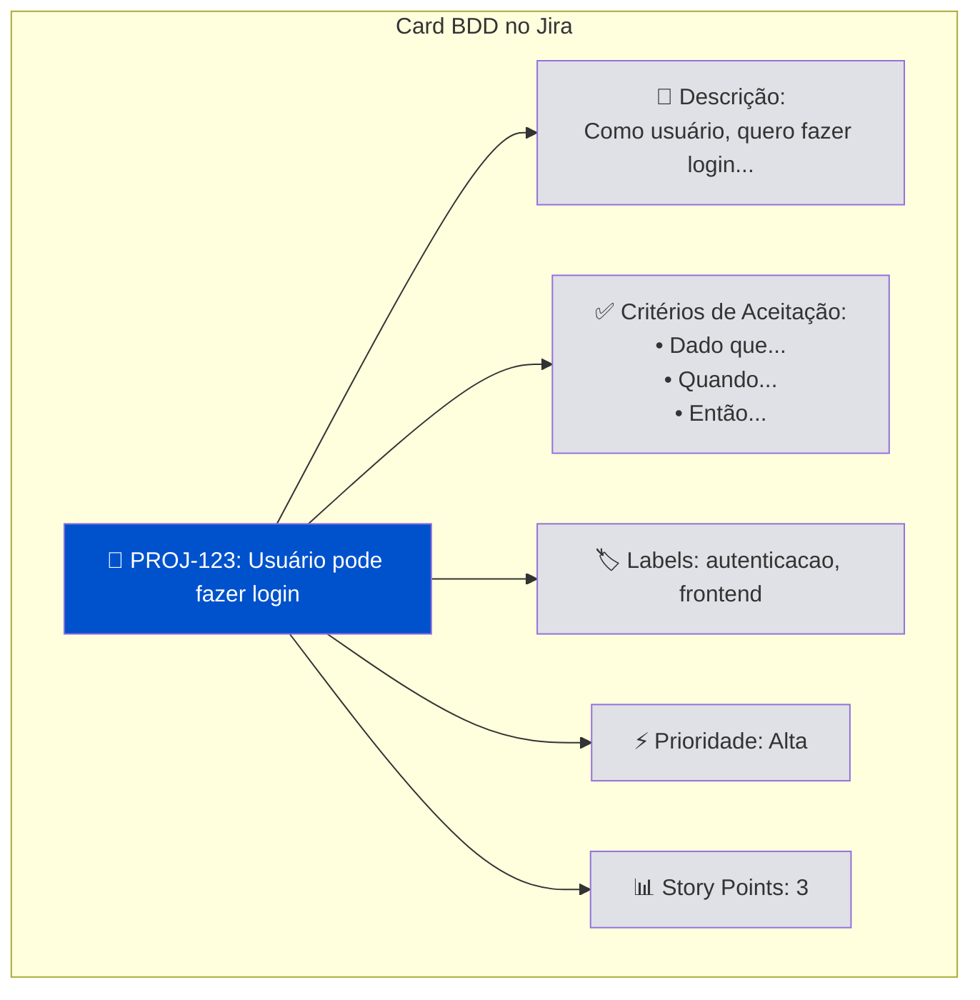

## 🛡️ Sistema de Segurança e Proteção

### Tentativas Automáticas

Se algo der errado (internet instável, API fora do ar), a ferramenta tenta novamente automaticamente:

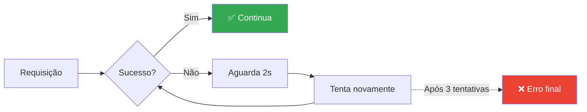

**Situações cobertas:**
- ⚡ Problemas de rede
- 🚦 Limite de requisições (rate limit)
- 🔄 Timeout de API
- 🔌 Servidor temporariamente indisponível

### Cache Inteligente

Todos os resultados são salvos localmente para você consultar depois:

```
.cache/
├── source_doc_latest.md          # Último documento lido
├── source_doc_2024-11-26_10-30.md # Versão com data/hora
├── bdd_cards_latest.json         # Últimos cards gerados
├── bdd_cards_2024-11-26_10-35.json # Versão com data/hora
└── gepeto_response_latest.txt    # Resposta bruta da IA
```

**Por que isso é útil:**
- 📊 Comparar diferentes versões
- 🔍 Entender o que a IA gerou
- 🐛 Resolver problemas
- 📝 Documentar o processo

## 🆘 Resolução de Problemas

### Fluxograma de Diagnóstico

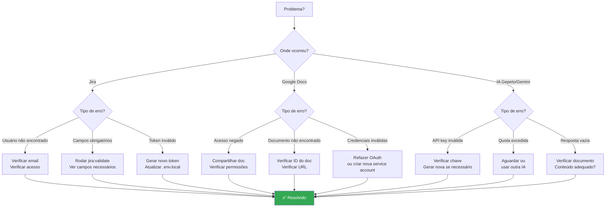

### Problemas Comuns e Soluções

#### 1. "Jira user not found" (Usuário do Jira não encontrado)

**Sintoma:** Mensagem dizendo que seu usuário não foi encontrado no Jira

**Causas possíveis:**
- ❌ Email digitado errado no `.env.local`
- ❌ Você não tem acesso ao projeto Jira
- ❌ Seu usuário foi desativado

**Solução:**
```bash
# 1. Verifique se o email está correto
cat .env.local | grep JIRA_EMAIL

# 2. Teste o acesso ao Jira
npm run dev jira:validate

# 3. Se necessário, atualize o email
# Edite .env.local com o email correto
```

#### 2. "Google Docs access denied" (Acesso negado ao documento)

**Sintoma:** Erro ao tentar ler o documento do Google Docs

**Causas possíveis:**
- ❌ Documento não foi compartilhado com você
- ❌ Service account sem permissão
- ❌ ID do documento incorreto

**Solução:**
```bash
# Para Service Account:
# 1. Abra o Google Docs
# 2. Clique em "Compartilhar"
# 3. Adicione o email da service account (termina com @iam.gserviceaccount.com)
# 4. Dê permissão de "Leitor"

# Para OAuth:
# 1. Verifique se fez login com a conta certa
# 2. Delete o token e faça login novamente:
rm .google_tokens.json
npm run dev workflow
```

#### 3. "API key invalid" (Chave de API inválida)

**Sintoma:** Erro de autenticação com Gepeto ou Gemini

**Solução:**
```bash
# 1. Verifique se a chave está correta (sem espaços extras)
cat .env.local | grep API_KEY

# 2. Para Gemini, gere uma nova chave:
# https://makersuite.google.com/app/apikey

# 3. Para Gepeto, entre em contato com seu admin

# 4. Atualize no .env.local
```

#### 4. "Required fields missing" (Campos obrigatórios faltando)

**Sintoma:** Jira reclama que faltam campos para criar a tarefa

**Solução:**
```bash
# 1. Descubra quais campos são obrigatórios
npm run dev jira:validate

# 2. A ferramenta vai mostrar algo como:
#    • Summary (summary) - string
#    • Issue Type (issuetype) - object
#    • Project (project) - object
#    • Story Points (customfield_10016) - number

# 3. A ferramenta preenche automaticamente os campos padrão
# 4. Se ainda assim falhar, pode ser um campo customizado do seu Jira
```

### Modo de Depuração (Debug)

Para ver TODOS os detalhes do que está acontecendo:

```bash
# Ativa logs detalhados
npm run dev workflow --verbose --dry-run
```

**O que você vai ver:**
- 🔍 Cada chamada de API
- 📤 Dados enviados
- 📥 Dados recebidos
- ⏱️ Tempo de cada operação
- 🔄 Tentativas de retry

### Modo de Teste Seguro

**SEMPRE teste primeiro antes de criar tarefas de verdade!**

```bash
# Modo dry-run: simula tudo, não cria nada
npm run dev workflow --dry-run

# Você vai ver:
# ✅ Documento lido com sucesso
# ✅ 15 cards BDD gerados
# 📋 Would create 15 issues in PROJ:
#    1. Usuário pode fazer login
#    2. Usuário pode redefinir senha
#    3. ...
# 
# ⚠️ DRY RUN MODE - No actual API calls were made
```

### Checklist de Troubleshooting

Use esta lista quando algo der errado:

- [ ] Arquivo `.env.local` existe e está preenchido?
- [ ] Tokens e chaves de API estão corretos?
- [ ] Internet está funcionando?
- [ ] Consegue acessar Jira e Google Docs manualmente?
- [ ] Rodou `npm install` depois de baixar o projeto?
- [ ] Versão do Node.js é 18 ou superior? (`node --version`)
- [ ] Tentou em modo `--verbose` para ver mais detalhes?
- [ ] Verificou os arquivos em `.cache/` para entender o erro?

### Logs e Arquivos de Diagnóstico

Quando pedir ajuda, envie estes arquivos:

```bash
# 1. Versão do Node
node --version > diagnostico.txt

# 2. Último log de erro
cat .cache/source_doc_latest.md >> diagnostico.txt

# 3. Cards gerados (se houver)
cat .cache/bdd_cards_latest.json >> diagnostico.txt

# ⚠️ NUNCA envie o arquivo .env.local (contém senhas!)
```

## 🧪 Testando a Ferramenta

### Níveis de Teste

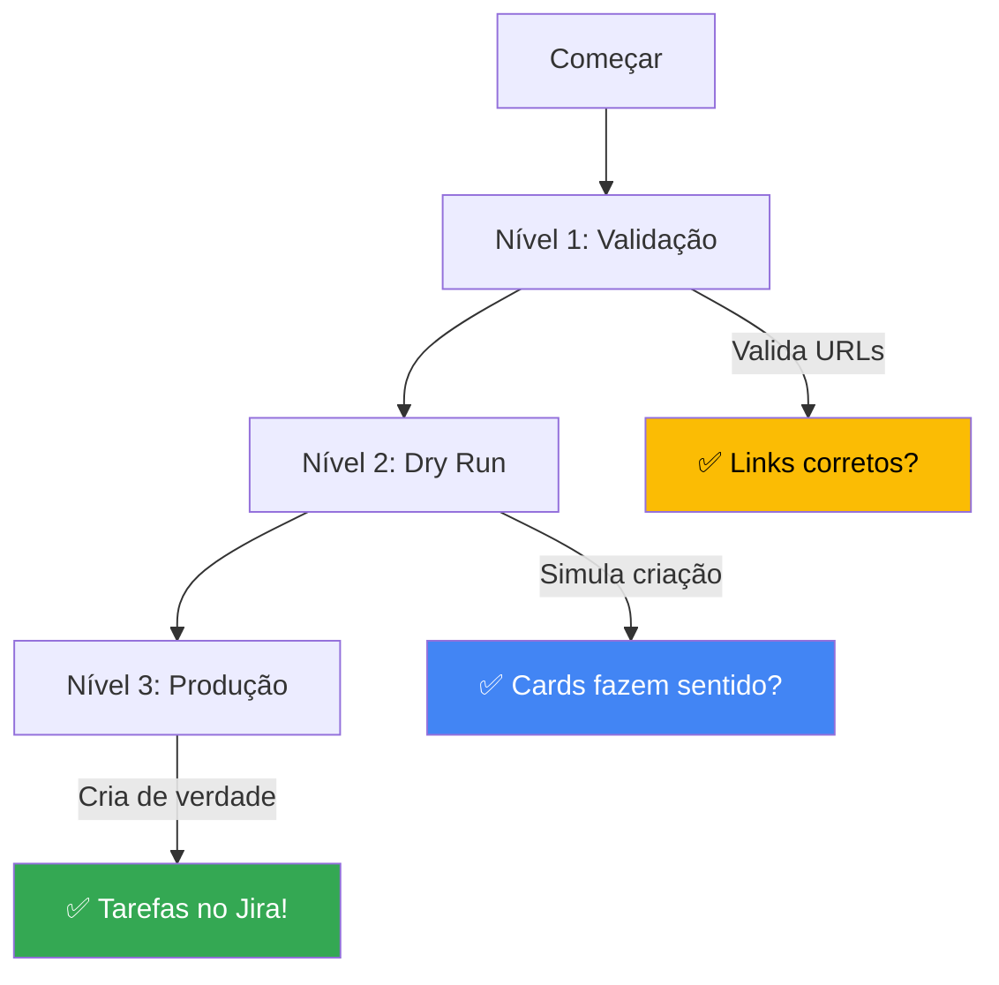

### Nível 1: Validação de Links (30 segundos)

**O que testa:** Se os links estão corretos

```bash
npm run validate-links \
  -d "https://docs.google.com/document/d/1ABC123/edit" \
  -j "https://empresa.atlassian.net/jira/software/projects/PROJ/boards/123"
```

**Resultado esperado:**
```
✅ Google Docs URL is valid
   Document ID: 1ABC123
   Clean URL: https://docs.google.com/document/d/1ABC123/edit

✅ Jira URL is valid
   Base URL: https://empresa.atlassian.net
   Project Key: PROJ
   Board ID: 123
```

### Nível 2: Dry Run - Teste Completo Seguro (2 minutos)

**O que testa:** Todo o fluxo, mas SEM criar tarefas de verdade

```bash
npm run quick-create \
  "https://docs.google.com/document/d/1ABC123/edit" \
  "https://empresa.atlassian.net/jira/software/projects/PROJ/boards/123" \
  --dry-run
```

**O que acontece:**
1. ✅ Lê o documento do Google Docs (de verdade)
2. ✅ Envia para a IA e gera cards (de verdade)
3. ✅ Valida com o Jira (de verdade)
4. ⚠️ **NÃO cria as tarefas** (apenas simula)

**Resultado esperado:**
```
📄 Document: Especificações do Produto v2.0
🤖 Generated 12 BDD cards using Gepeto

🔍 DRY RUN MODE - Preview only
Would create 12 issues in PROJ:
  1. Usuário pode fazer login com email
  2. Usuário pode redefinir senha
  3. Sistema valida formato de email
  ...

✅ Use --live flag to create issues
```

### Nível 3: Produção - Criação Real (2 minutos)

**O que faz:** Cria as tarefas DE VERDADE no Jira

```bash
npm run quick-create \
  "https://docs.google.com/document/d/1ABC123/edit" \
  "https://empresa.atlassian.net/jira/software/projects/PROJ/boards/123" \
  --live
```

**Resultado esperado:**
```
🎉 Success! Created 12 issues:
  • PROJ-456: https://empresa.atlassian.net/browse/PROJ-456
  • PROJ-457: https://empresa.atlassian.net/browse/PROJ-457
  • PROJ-458: https://empresa.atlassian.net/browse/PROJ-458
  ...
```

### Sequência Recomendada para Primeiro Uso

```bash
# 1. Configure tudo
npm run dev init

# 2. Valide os links
npm run validate-links -d "URL_DOCS" -j "URL_JIRA"

# 3. Teste completo sem criar (veja o que seria criado)
npm run quick-create "URL_DOCS" "URL_JIRA" --dry-run

# 4. Se estiver tudo certo, crie de verdade
npm run quick-create "URL_DOCS" "URL_JIRA" --live

# 5. Acesse o Jira e veja as tarefas criadas!
```

### Comparação: Antes vs Depois

| Ação | Sem a Ferramenta | Com a Ferramenta |
|------|------------------|------------------|
| Ler documento | 15 min | Automático |
| Criar 20 tarefas | 60 min (3 min cada) | 2 min (todas juntas) |
| Formatação BDD | Inconsistente | Padronizada |
| Critérios de aceitação | Às vezes esquece | Sempre incluídos |
| **TOTAL** | **~75 minutos** | **~2 minutos** |

💰 **Economia:** 97% do tempo!

## 🏗️ Estrutura do Projeto (Para Desenvolvedores)

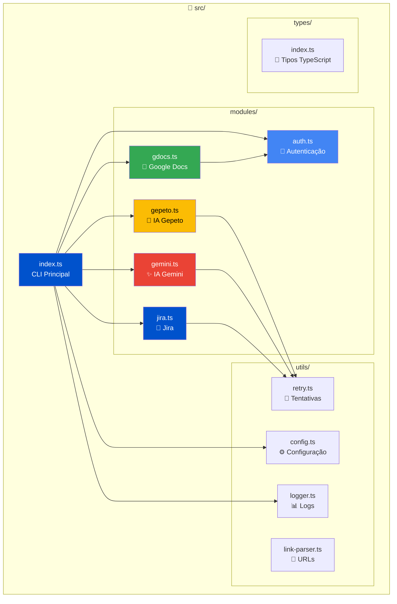

### Descrição dos Módulos

| Módulo | Responsabilidade | Tecnologias |
|--------|------------------|-------------|
| **auth.ts** | Gerencia autenticação OAuth com Google | Google OAuth2, Token storage |
| **gdocs.ts** | Lê e normaliza documentos | Google Docs API |
| **gepeto.ts** | Integração com IA Gepeto | HTTP/REST, Retry logic |
| **gemini.ts** | Integração com Google Gemini | Google Generative AI API |
| **jira.ts** | Cria e valida issues | Jira REST API, ADF format |
| **config.ts** | Gerencia configurações | Zod validation, .env parsing |
| **logger.ts** | Sistema de logs | Colorização, níveis de log |
| **retry.ts** | Lógica de retry com backoff | Exponential backoff |
| **link-parser.ts** | Parse de URLs | Regex, URL extraction |

### Compilar o Projeto

```bash
# Compila TypeScript para JavaScript
npm run build

# Resultado: arquivos JS em dist/
```

### Modo de Desenvolvimento

```bash
# Executa direto do TypeScript (mais rápido para desenvolver)
npm run dev <comando>

# Exemplo:
npm run dev workflow --verbose
```

## 🔒 Segurança e Boas Práticas

### ⚠️ O que NUNCA fazer:

```bash
# ❌ NUNCA commite arquivos com senhas
git add .env.local          # ERRADO!
git add .env                # ERRADO!
git add *_tokens.json       # ERRADO!

# ✅ SEMPRE use .gitignore
# Estes arquivos já estão ignorados:
# - .env.local
# - .env
# - .google_tokens.json
# - .gemini_tokens.json
```

### 🛡️ Checklist de Segurança

- [ ] Arquivo `.env.local` NÃO está no Git
- [ ] Tokens são rotacionados regularmente (a cada 3-6 meses)
- [ ] Service accounts têm apenas permissões necessárias
- [ ] Tokens ficam em arquivos locais, não em código
- [ ] Ambientes de teste e produção são separados
- [ ] Logs não exibem tokens ou senhas (use `--verbose` só em dev)

### 🔑 Rotação de Tokens (Recomendado a cada 3 meses)

```bash
# 1. Jira: Gerar novo token
# https://id.atlassian.com/manage-profile/security/api-tokens

# 2. Gemini: Gerar nova chave
# https://makersuite.google.com/app/apikey

# 3. Google OAuth: Renovar credenciais se necessário
# https://console.cloud.google.com/

# 4. Atualizar .env.local com novos valores

# 5. Testar
npm run dev workflow --dry-run
```

## ❓ Perguntas Frequentes (FAQ)

### 1. Posso usar em português?

✅ **Sim!** A ferramenta funciona em qualquer idioma. A IA entende o conteúdo e gera cards no mesmo idioma do documento.

### 2. Quantas tarefas posso criar de uma vez?

📊 **Recomendado:** Até 50 tarefas por execução. Para documentos maiores, divida em partes.

### 3. A IA pode errar?

🤖 **Sim.** A IA faz o melhor possível, mas:
- Sempre use `--dry-run` primeiro para revisar
- Cards muito complexos podem precisar de ajustes manuais
- Se o documento estiver confuso, a IA pode gerar cards imprecisos

### 4. Preciso pagar pela IA?

💰 **Depende:**
- **Gepeto**: Contate seu administrador
- **Gemini**: Tem plano gratuito com limites. Veja: https://ai.google.dev/pricing

### 5. Funciona com Jira Server (on-premise)?

✅ **Sim!** Basta configurar a URL correta do seu servidor Jira.

### 6. Posso customizar os campos gerados?

⚙️ **Sim.** Edite o arquivo `src/modules/jira.ts` na função `buildIssuePayload()` para adicionar campos customizados.

### 7. Suporta outros formatos além de Google Docs?

📝 **Não diretamente.** Mas você pode:
1. Converter outros formatos para Google Docs
2. Ou salvar como `.md` e usar o comando `markdown:read`

### 8. Os dados ficam seguros?

🔒 **Sim!**
- Tokens ficam apenas no seu computador
- A IA processa o texto mas não armazena permanentemente
- Conexões são criptografadas (HTTPS)

## 🤝 Como Contribuir

Quer melhorar o projeto?

1. **Fork** o repositório
2. Crie um **branch** para sua feature: `git checkout -b minha-feature`
3. **Commit** suas mudanças: `git commit -m 'Adiciona nova feature'`
4. **Push** para o branch: `git push origin minha-feature`
5. Abra um **Pull Request**

### Ideias de Melhorias

- [ ] Suporte para Notion, Confluence, etc.
- [ ] Interface gráfica (GUI)
- [ ] Integração com GitHub Issues
- [ ] Suporte para outras IAs (Claude, ChatGPT)
- [ ] Templates customizáveis de cards
- [ ] Dashboard de métricas

## 📞 Suporte e Ajuda

Precisa de ajuda?

1. 📖 **Leia a seção de Troubleshooting** acima
2. 🔍 **Verifique os logs** em `.cache/`
3. 🐛 **Execute em modo verbose**: `--verbose`
4. 💬 **Abra uma issue** no GitHub
5. 📧 **Entre em contato** com a equipe


---

<div align="center">

**Feito com ❤️ para automatizar tarefas repetitivas**

[⬆ Voltar ao topo](#-bdd-card-generator)

</div>
